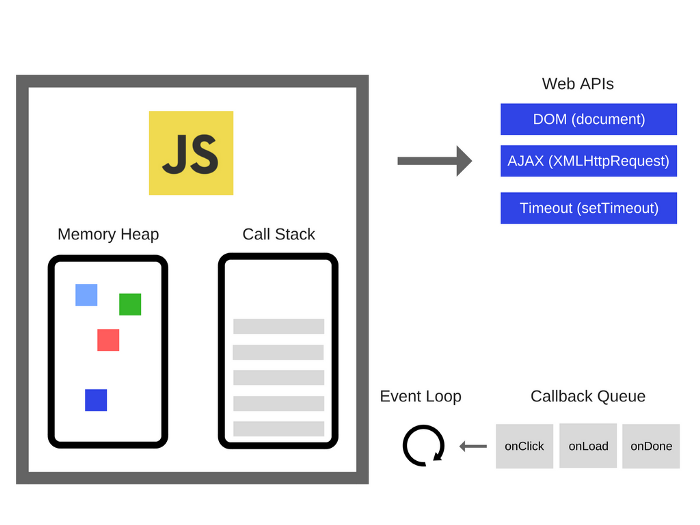
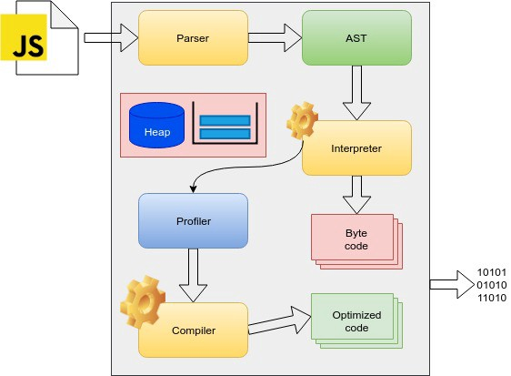
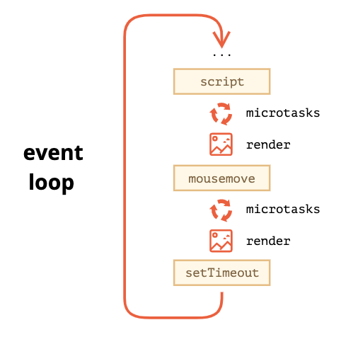

雖然 Javascript 是一個單一執行緒(Single Thread)的程式語言，同一時間只能執行一項任務，但因為底層**事件迴圈(Event Loop)**這個機制讓他有能力以非同步的方式同時處理多項任務，這篇文章將會深入解釋事件迴圈，幫助開發者更清楚自己寫出的程式碼是如何在底層運作。

<!--truncate-->

## Overview

本篇文章會包含以下主題，從了解 Javascript 的執行環境及資料結構到事件迴圈詳細的運作流程，也算是涵蓋從初階到進階 Javascript 開發者都必須知道的內容。

- Javascript Engine
- Memory Heap
- Call Stack
- Javascript Runtime
- 同步與非同步
- 事件迴圈 Event Loop
- Macrotask queue vs Microtask queue


[https://suprabhasupi.hashnode.dev/how-javascript-works](https://suprabhasupi.hashnode.dev/how-javascript-works)

## Javascript Engine

電腦上真正執行運算工作的是 CPU，但 CPU 只能理解機器語言(Machine code)，無法直接讀懂 Javascript 這種高階語言，Javascript Engine 的功能就是把 Javascript 翻譯成機器語言，如此一來我們就不用直接撰寫可讀性差的機器語言。


[https://suprabhasupi.hashnode.dev/how-javascript-works](https://suprabhasupi.hashnode.dev/how-javascript-works)

Engine 裡包含很多模組，本篇文章只會介紹其中的 Interpreter, Compiler, Memory Heap 以及 Call Stack。

Engine 會透過兩個步驟翻譯 Javascript，第一個是 Interpreter 會先將 js 轉成 Bytecode，第二個是 Compiler 會將 Bytecode 轉成 Machine Code 同時 Profiler 會一起進行優化。


最常聽見的 V8 Engine 是由 Google 開發，被使用在 Chrome 以及 Node.js 上，但其實還有[其他很多 Engine](https://www.wikiwand.com/en/List_of_ECMAScript_engines)，只要符合 ECMAScript 制定的標準大家都可以開發自己的 Javascript Engine.

## Memory Heap

主要有以下功能:

1. 分配記憶體空間給變數使用，分配好之後會得到一個位址
2. 將變數的值寫進配置好的記憶體空間
3. 使用位址從記憶體空間讀取變數的值
4. 釋放不再使用的記憶體空間(Garbage Collection)

舉例來說，Memory Heap 就像是一個抽屜櫃，每個有放東西的抽屜都會有一個編號，程式會用這個編號去找東西。

抽屜櫃 →Memory Heap

抽屜 → 記憶體空間

東西 → 變數的值

編號 → 記憶體位址(reference)

## Call Stack

Stack 是一個先進後出(FILO, First In Last Out)類似罐子的結構，當程式呼叫函式(Call function)時會把函式放進 stack 中，直到函式執行結束 return 後再將函式從 stack 中取出。

Call Stack 的最底層一定會有一個**[Global Execution Context](https://medium.com/itsems-frontend/javascript-execution-context-and-call-stack-e36e7f77152e)**，提供其他函式存取 global object 以及`this`關鍵字。

因為 Javascript 只有一個 Call Stack 程式中所有的任務都會在這個 Stack 中執行，所以被稱為 Single Thread，這個設計讓他同一時間只有辦法執行一件任務，無法同時執行多件任務，也就是所謂的 Synchronous。

Javascript 雖然只有一個 Engine 在執行任務，但通常背後還有 Runtime 在非同步的執行任務。


[https://suprabhasupi.hashnode.dev/how-javascript-works](https://suprabhasupi.hashnode.dev/how-javascript-works)

## Javascript Runtime

Runtime 指的是在執行時期提供 Global Object 給 JS Engine 讓它有能力與執行環境互動。

在 Browser 環境中 Runtime 就是 Web APIs，JS Engine 可以透過`window` object 來使用 Web APIs，透過 Web APIs 執行非同步的任務，例如操作 DOM, AJAX, setTimeout 等。

在 Node.js 環境中 Runtime 就是 Global APIs，JS Engine 可以透過`global` object 來使用各種 built-in API，例如 Buffer, process, require 等。

## 詳細解釋同步與非同步

同步(Synchronous)指的是程式碼的執行順序是由上往下一行一行的執行，同一時間只能做一件事，也就是上一行的程式如果沒有執行完就會卡住下一行程式的執行造成阻塞(blocking)，導致後面的程式都無法執行，如果遇到複雜的數學運算或是需要大量 CPU 運算的任務時就會嚴重影響程式的運作。

非同步(Asynchronous)指的是會先將工作丟出去給其他執行環境(Runtime)處理，不阻塞(non-blocking)後續程式的執行，處理完成後再將結果傳給回調函式(callback function)，然後等待 Event Loop，例如 AJAX 或是讀檔寫檔這種存取外部資料的 I/O 都是常見的非同步行為。

## 事件迴圈 Event Loop 的運作流程

了解了以上模組之後，Event Loop 也會很好理解，其實就是這些模組一起互動之下形成的無限迴圈，迴圈流程如下

1. Javascript engine 執行 call stack 中的任務。
2. 當遇到 Web APIs 或是無法處理的任務時會交給 Javascript runtime 執行，Javascript runtime 處理完成後會將資料交給 callback function，並將 callback function 放進 queue 中，形成 Callback Queue。
3. Javascript runtime 等待 call stack 中的任務全部執行結束變成空的，從 callback queue 中拉取第一個任務放進 call stack，回到第一步繼續重複循環下去。

可以參考這個影片

<iframe width="560" height="315" src="https://www.youtube.com/embed/N0Au8yc5IOw" title="YouTube video player" frameborder="0" allow="accelerometer; autoplay; clipboard-write; encrypted-media; gyroscope; picture-in-picture" allowfullscreen></iframe>

## 細談 Callback Queue

上面說到的 Callback Queue 是存放 callback function 地方，也有很多別名例如 Event Queue, Task Queue。

通常大部分的文章都只會說到 Callback Queue 就結束了，但實際上他又可以被細分為 Macrotask Queue 以及 Microtask Queue，差別在於 queue 中存放的任務有所不同。

## Macrotask Queue

macrotask 包含：

- 從 `<script src="...">` 外部下載的 script
- DOM event handlers，例如 mousemove event 的 callback function handler
- 各種 Web APIs，例如 setTimeout 的 callback function
- ajax callback function

macrotask 在執行時瀏覽器不會渲染(render)DOM，瀏覽器會被阻塞住，也就是只執行 macrotask 不會做其他事情，有時我們會看到瀏覽器跳出頁面沒有回應的警告，可能就是因為 macrotask 有複雜運算(CPU-hungry tasks)或是程式邏輯錯誤導致無限迴圈發生，使得其他任務無法被處理。


[https://javascript.info/event-loop](https://javascript.info/event-loop)

## Microtask Queue

microtask 包含:

- promise `.then/catch/finally` 中的 callback function
- `queueMicrotask(func)` 中的 func

每個 macrotask 執行結束後會先將 microtask queue 中的 task 全部執行完，才會繼續執行瀏覽器渲染跟其他 macrotask。

將 callback queue 分解成 macrotask 以及 microtask 之後，他們在 Event Loop 中詳細的運作流程會是這樣：

1. 從 macrotask queue 中拿出一個 macrotask 丟到 call stack 中執行。
2. 將 microtask queue 中全部的 task 依照順序 Dequeue 到 call stack 中執行。
3. Browser render DOM。
4. 如果 macrotask queue 是空的，sleep 直到 macrotask 再次出現。
5. 回到步驟 1。

  
[https://javascript.info/event-loop](https://javascript.info/event-loop)

## Test

```javascript
setTimeout(() => alert('timeout'));

Promise.resolve().then(() => alert('promise'));

alert('code');
```

可以先想想輸出結果，再貼到 console 中執行看答案是不是跟自己想的一樣，如果一樣的話代表你已經了解事件迴圈囉！

如果有任何問題或建議都非常歡迎留言討論，謝謝！

## Reference

[https://javascript.info/event-loop](https://javascript.info/event-loop)

[https://javascript.info/microtask-queue](https://javascript.info/microtask-queue)

[https://suprabhasupi.hashnode.dev/how-javascript-works](https://suprabhasupi.hashnode.dev/how-javascript-works)

[https://pjchender.blogspot.com/2017/08/javascript-learn-event-loop-stack-queue.html](https://pjchender.blogspot.com/2017/08/javascript-learn-event-loop-stack-queue.html)

[https://www.youtube.com/watch?v=8aGhZQkoFbQ&ab_channel=JSConf](https://www.youtube.com/watch?v=8aGhZQkoFbQ&ab_channel=JSConf)

[https://developer.mozilla.org/en-US/docs/Web/JavaScript/Memory_Management](https://developer.mozilla.org/en-US/docs/Web/JavaScript/Memory_Management)

[https://eyesofkids.gitbooks.io/javascript-start-from-es6/content/part4/eventloop.html](https://eyesofkids.gitbooks.io/javascript-start-from-es6/content/part4/eventloop.html)
